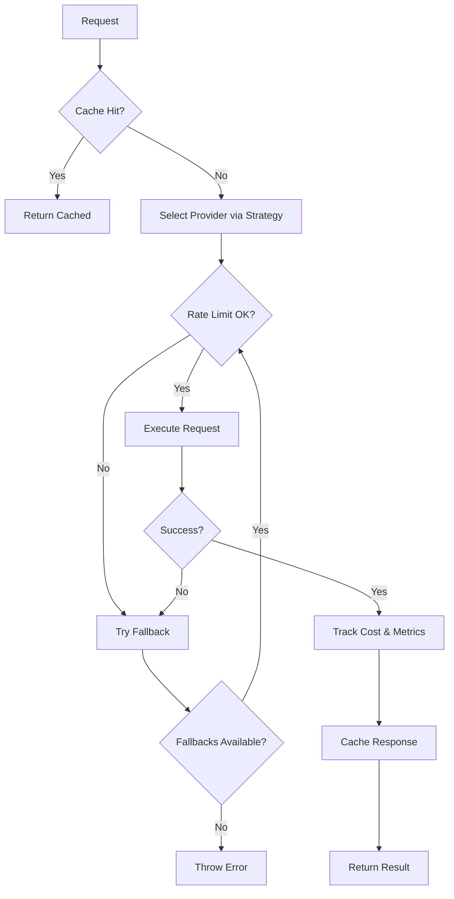

# Enhanced Provider System V2

Een volledig vernieuwde AI provider architectuur met plugin systeem, caching, rate limiting, cost tracking en metrics.

## 🎯 Overzicht

De Provider System V2 biedt:

1. **Plugin Architectuur** - Dynamische provider registratie
2. **Caching Layer** - LRU cache voor responses
3. **Rate Limiting** - Per-provider request limiting
4. **Cost Tracking** - Gedetailleerde cost analytics
5. **Metrics Collection** - Performance monitoring
6. **Configuration Management** - Runtime configuratie
7. **Provider Selection Strategies** - Intelligente provider keuze
8. **Automatic Fallback** - Robuuste error handling

---

## 📦 Architectuur

```
providers/
├── base.ts                 # Base interfaces (AIProvider, StreamChunk)
├── registry.ts             # Provider registry met metadata
├── factory-v2.ts           # Enhanced factory met alle features
├── cache.ts                # Response caching layer
├── rate-limiter.ts         # Per-provider rate limiting
├── cost-tracker.ts         # Cost tracking en analytics
├── metrics.ts              # Performance metrics
├── config-manager.ts       # Configuration management
├── mock-provider.ts        # Mock provider voor testing
├── openai-provider.ts      # OpenAI implementatie
├── anthropic-provider.ts   # Anthropic/Claude implementatie
├── bootstrap.ts            # Provider registratie
└── index.ts                # Main exports
```

---

## 🚀 Quick Start

### Basis Gebruik

```typescript
import { providerFactoryV2 } from './lib/providers/index.js';

// Refine schema met auto provider selection
const result = await providerFactoryV2.refineSchema({
  schema: {
    code: 'z.object({ name: z.string() })',
    typeName: 'User',
    fields: { name: 'z.string()' }
  },
  samples: [{ name: 'John' }]
});
```

### Provider Registratie

```typescript
import { providerFactoryV2, type ProviderMetadata } from './lib/providers/index.js';

// Nieuwe provider registreren
const metadata: ProviderMetadata = {
  name: 'gemini',
  displayName: 'Google Gemini',
  description: 'Google Gemini Pro',
  costPerInputToken: 0.00025,
  costPerOutputToken: 0.0005,
  maxRequestsPerMinute: 60,
  maxTokensPerRequest: 32768,
  features: {
    streaming: true,
    jsonMode: true,
    functionCalling: true,
    vision: true
  },
  priority: 85,
  weight: 0.5,
  enabled: true
};

providerFactoryV2.registerProvider(geminiProvider, metadata);
```

---

## ⚙️ Configuration

### Strategieën

```typescript
import { configManager } from './lib/providers/index.js';

// Set strategy
configManager.setStrategy('priority');    // Gebruik hoogste priority
configManager.setStrategy('cost');        // Gebruik goedkoopste
configManager.setStrategy('performance'); // Gebruik snelste
configManager.setStrategy('round-robin'); // Rotate tussen providers
configManager.setStrategy('weighted');    // Weighted random
configManager.setStrategy('manual');      // Handmatige selectie
```

### Runtime Configuratie

```typescript
// Update configuratie
configManager.updateConfig({
  enableCache: true,
  cacheTTL: 7200000,              // 2 uur
  enableFallback: true,
  maxFallbackAttempts: 3,
  dailyBudgetLimit: 50.00,        // $50 per dag
  requestTimeout: 45000,          // 45 seconden
  preferredProviders: ['anthropic', 'openai']
});
```

---

## 💾 Caching

```typescript
import { responseCache } from './lib/providers/index.js';

// Cache stats ophalen
const stats = responseCache.getStats();
console.log(`Hit rate: ${(stats.hitRate * 100).toFixed(2)}%`);
console.log(`Total entries: ${stats.totalEntries}`);
console.log(`Memory: ${(stats.memorySizeBytes / 1024).toFixed(2)} KB`);

// Cache clearen
responseCache.clear();

// Cache invalideren voor specifiek request
responseCache.invalidate(request);

// Cache uitzetten
responseCache.setEnabled(false);
```

---

## ⏱️ Rate Limiting

```typescript
import { rateLimiter } from './lib/providers/index.js';

// Rate limit status ophalen
const status = rateLimiter.getStatus('openai');
console.log(`Requests: ${status.requestCount}/${status.maxRequests}`);
console.log(`Blocked: ${status.blocked}`);

// Rate limit resetten
rateLimiter.reset('openai');
rateLimiter.resetAll();

// Alle statussen
const allStatuses = rateLimiter.getAllStatuses();
```

---

## 💰 Cost Tracking

```typescript
import { costTracker } from './lib/providers/index.js';

// Cost summary ophalen
const summary = costTracker.getSummary();
console.log(`Total cost: $${summary.totalCost.toFixed(4)}`);
console.log(`Total requests: ${summary.totalRequests}`);
console.log(`Average per request: $${summary.averageCostPerRequest.toFixed(6)}`);

// Per provider
Object.entries(summary.byProvider).forEach(([name, stats]) => {
  console.log(`${name}: $${stats.cost.toFixed(4)} (${stats.requests} requests)`);
});

// Meest cost-effective provider
const best = costTracker.getMostCostEffective(
  [
    { name: 'openai', costPerInputToken: 0.01, costPerOutputToken: 0.03 },
    { name: 'anthropic', costPerInputToken: 0.003, costPerOutputToken: 0.015 }
  ],
  1000, // input tokens
  500   // output tokens
);

console.log(`Best provider: ${best.provider} ($${best.estimatedCost.toFixed(6)})`);

// Export als CSV
const csv = costTracker.exportCSV();
```

---

## 📊 Metrics

```typescript
import { metricsCollector } from './lib/providers/index.js';

// Provider metrics
const metrics = metricsCollector.getMetrics('openai');
console.log(`Success rate: ${(metrics.successRate * 100).toFixed(2)}%`);
console.log(`Avg response time: ${metrics.averageResponseTime.toFixed(0)}ms`);

// Top performers
const topProviders = metricsCollector.getTopProviders(3);
topProviders.forEach(({ provider, metrics }) => {
  console.log(`${provider}: ${(metrics.successRate * 100).toFixed(2)}% success`);
});

// Fastest providers
const fastest = metricsCollector.getFastestProviders(3);

// Error breakdown
const errors = metricsCollector.getErrorBreakdown('openai');
Object.entries(errors).forEach(([error, stats]) => {
  console.log(`${error}: ${stats.count} (${stats.percentage.toFixed(2)}%)`);
});

// Timeline
const timeline = metricsCollector.getTimeline('openai', 60000); // 1 min intervals
```

---

## 🎛️ Provider Management

```typescript
// Provider in-/uitschakelen
providerFactoryV2.setProviderEnabled('openai', false);

// Priority aanpassen
providerFactoryV2.setProviderPriority('anthropic', 95);

// Weight aanpassen (voor weighted strategy)
providerFactoryV2.setProviderWeight('openai', 0.8);

// Alle providers ophalen
const providers = providerFactoryV2.getAllProviders();

// Health check
const health = await providerFactoryV2.checkAllProviders();
console.log(health); // { openai: true, anthropic: true }
```

---

## 🧪 Testing met Mock Provider

```typescript
import { createMockProvider } from './lib/providers/index.js';

// Mock provider aanmaken
const mock = createMockProvider({
  responseTime: 200,        // 200ms simulated delay
  successRate: 0.9,         // 90% success rate
  enableStreaming: true,
  errorMessage: 'Simulated failure'
});

// Registreren
providerFactoryV2.registerProvider(mock, mockMetadata);

// Test request count
console.log(mock.getRequestCount()); // 5
mock.resetRequestCount();
```

---

## 🔄 Provider Selection Flow



---

## 📈 Monitoring Dashboard Voorbeeld

```typescript
// Complete monitoring overview
function getSystemStatus() {
  return {
    cache: responseCache.getStats(),
    rateLimits: rateLimiter.getAllStatuses(),
    costs: costTracker.getSummary(),
    metrics: metricsCollector.getAllMetrics(),
    config: configManager.getConfig(),
    providers: providerFactoryV2.getAllProviders().map(p => ({
      name: p.name,
      enabled: p.metadata.enabled,
      priority: p.metadata.priority,
      health: providerRegistry.getHealthStatus(p.name)
    }))
  };
}

const status = getSystemStatus();
console.log(JSON.stringify(status, null, 2));
```

---

## 🔌 Nieuwe Provider Toevoegen

1. **Implementeer AIProvider interface**

```typescript
import type { AIProvider } from './base.js';

export class MyCustomProvider implements AIProvider {
  readonly name = 'mycustom';

  async refineSchema(request: RefinementRequest) {
    // Implementation
  }

  async checkHealth() {
    return true;
  }

  getCapabilities() {
    return {
      supportsStreaming: false,
      supportsJsonMode: true,
      supportsFunctionCalling: false,
      supportsVision: false
    };
  }
}
```

2. **Registreer met metadata**

```typescript
const metadata: ProviderMetadata = {
  name: 'mycustom',
  displayName: 'My Custom Provider',
  description: 'Custom AI provider',
  costPerInputToken: 0.001,
  costPerOutputToken: 0.002,
  maxRequestsPerMinute: 100,
  maxTokensPerRequest: 4096,
  features: {
    streaming: false,
    jsonMode: true,
    functionCalling: false,
    vision: false
  },
  priority: 70,
  weight: 0.5,
  enabled: true
};

providerFactoryV2.registerProvider(new MyCustomProvider(), metadata);
```

---

## 🎯 Best Practices

1. **Gebruik caching** voor identieke requests
2. **Monitor costs** met daily budget limits
3. **Track metrics** voor performance insights
4. **Enable fallback** voor reliability
5. **Test met mock provider** voor development
6. **Tune priorities** voor custom workflows
7. **Use weighted strategy** voor load balancing
8. **Check health status** regelmatig

---

## 🔧 Troubleshooting

### High costs?
```typescript
// Check cost breakdown
const summary = costTracker.getSummary();
console.log(summary.byProvider);

// Set daily budget
configManager.updateConfig({ dailyBudgetLimit: 25.00 });

// Switch to cost strategy
configManager.setStrategy('cost');
```

### Rate limit errors?
```typescript
// Check status
rateLimiter.getStatus('openai');

// Reset if needed
rateLimiter.reset('openai');

// Adjust limits
rateLimiter.setLimit('openai', {
  maxRequests: 1000,
  windowMs: 60000,
  enabled: true
});
```

### Low cache hit rate?
```typescript
// Check stats
console.log(responseCache.getStats());

// Increase TTL
configManager.updateConfig({ cacheTTL: 7200000 }); // 2 hours

// Increase max entries
responseCache.updateConfig({ maxEntries: 5000 });
```

---

## 📝 Migration van V1 naar V2

```typescript
// Old (V1)
import { providerFactory } from './factory.js';
const result = await providerFactory.refineSchema(request);

// New (V2)
import { providerFactoryV2 } from './factory-v2.js';
const result = await providerFactoryV2.refineSchema(request);

// V2 heeft dezelfde interface maar met extra features!
```

---

## 🚀 Roadmap

- [ ] Streaming support implementeren
- [ ] Dashboard UI voor monitoring
- [ ] Webhook notifications voor budget alerts
- [ ] A/B testing framework
- [ ] Provider load balancing optimization
- [ ] Redis cache backend optie
- [ ] Prometheus metrics export

---

Built with ❤️ for ZodForge
